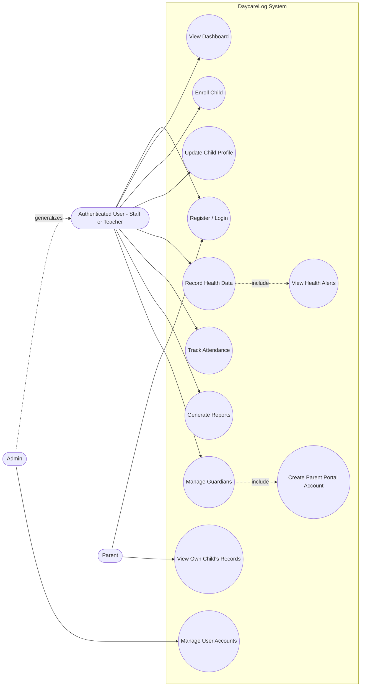
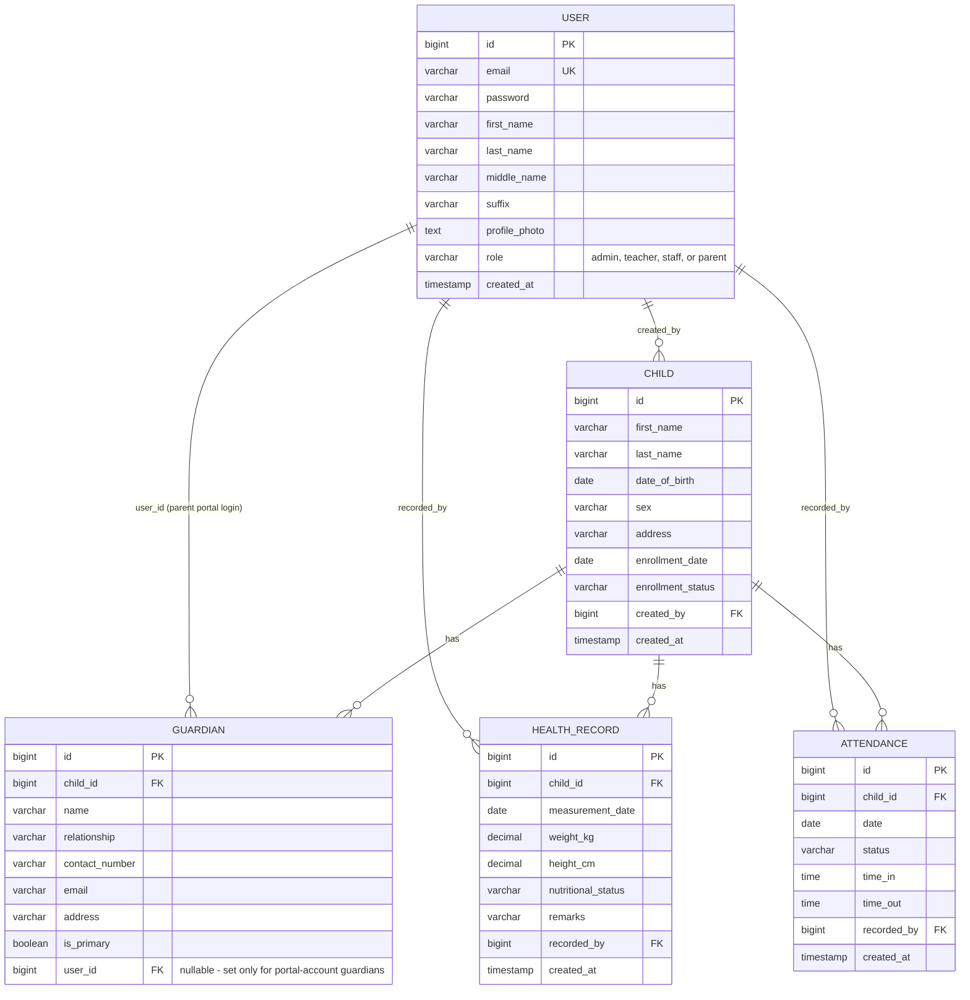
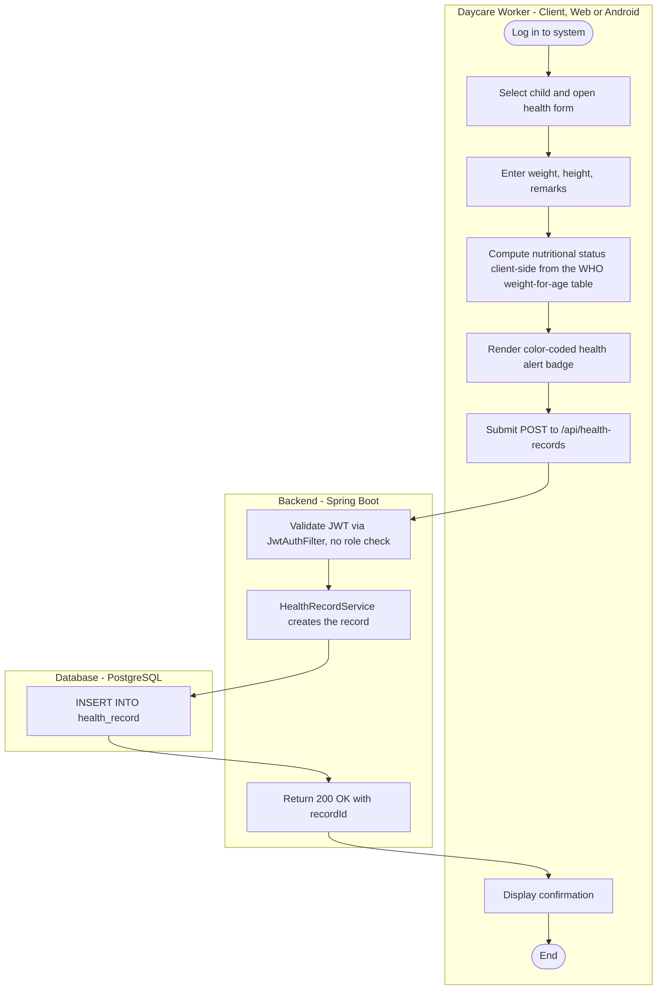
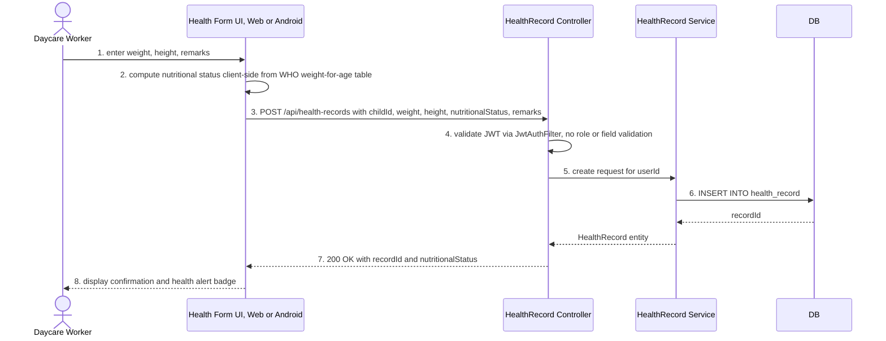

IT342-G01
SYSTEMS INTEGRATION AND ARCHITECTURE 1
SOFTWARE REQUIREMENTS SPECIFICATION (SRS)

Project Title: DaycareLog: A Digital Management System for Barangay Daycare Centers
Prepared By: Christian Earl V. Mahumot
Date of Submission: June 30, 2026 (mobile-parity revision: July 2, 2026; parent/guardian-portal revision: July 3, 2026)
Version: 2.2 (Parent/Guardian Portal Revision — supersedes Version 2.1, July 2, 2026)

> "I certify that this finalized SRS and UML models are my own individual work. I understand that copied, duplicated, or AI-generated submissions without proper understanding and revision may be subject to verification and possible deductions."
> — Christian Earl V. Mahumot

---

## 1. Introduction

### 1.1 Project Title
DaycareLog: A Digital Management System for Barangay Daycare Centers

### 1.2 System Overview
DaycareLog is an information system that digitizes the core recordkeeping operations of a single barangay daycare center: child enrollment, guardian information, health monitoring, and daily attendance. The system follows a client–server architecture composed of a Spring Boot 3 REST API backend secured with custom JSON Web Token (JWT) authentication, a PostgreSQL relational database (hosted on Supabase), and two clients that share the same backend: a React (Vite + Tailwind CSS) single-page web client deployed on Vercel, and a native Android application (Kotlin + Jetpack Compose, Material 3). The backend is deployed on Railway. The Android client was originally scoped as a future phase; it is now implemented, though with a narrower feature set than the web client in a few areas — see 1.6 for the specific gaps.

### 1.3 Purpose of the System
The purpose of DaycareLog is to replace manual, paper-based enrollment and health recordkeeping at the barangay daycare level with a centralized digital system. The system is intended to reduce data-entry errors and record loss and give Daycare Staff real-time visibility into each child's enrollment and health status.

### 1.4 Target Users
The system currently supports four account roles — **Admin**, **Teacher**, **Staff**, and **Parent** — as implemented in the `users` table and enforced at the API layer. The Parent role is new as of this revision: it is never self-registered, but created by an Admin or Staff user when they set up a portal account for a child's guardian. Full role descriptions and the actual scope of access enforced per role are provided in Section 2.

### 1.5 Problem Statement
Barangay daycare centers currently rely on manual, paper-based processes to manage child enrollment and health records. This results in records that are vulnerable to loss or physical damage, frequent data-entry errors, and slow record retrieval. The absence of a centralized digital system limits the ability of daycare staff to monitor children's health status in a timely and consistent manner.

### 1.6 Scope of the System
The current, implemented scope of DaycareLog covers:

1. **Child Enrollment Management** – registration, profile editing, and hard deletion of child records; client-side search by name and filter by enrollment status (web and mobile), with computed/displayed current age (web and mobile).
2. **Guardian Records** – a `guardians` database table (name, relationship, contact number, email, address, primary flag, linked to a child) is now **fully exposed through REST endpoints and dedicated UI on both clients**: a per-child guardian section embedded in the child's edit screen (add/remove contact-only guardians), and a standalone Guardians directory screen (web `Guardians.jsx`, mobile `GuardiansScreen.kt`) for managing guardians that have a parent-portal login. See item 8 below for the portal-account behavior.
3. **Health Record Monitoring** – weight/height capture per child, with nutritional status classification computed **client-side, independently in both the React web app and the Android app**, from the same simplified WHO weight-for-age median table (weight and age/sex only — height is not currently factored into the classification despite being captured). Both clients compute a live preview while filling out the form and send the resulting label to the backend to persist alongside the record. Health records can also be **deleted** (Admin/Staff only) via `DELETE /api/health-records/{id}`, available on both clients.
4. **Attendance Tracking** – daily attendance recording per child (web and mobile both expose Present/Absent/Late/Excused, broader than the original Present/Absent scope), with one entry enforced per child per day at the database level. Both clients now restrict attendance entry to **weekdays only (Monday–Friday)**: the date picker defaults to the nearest weekday and rejects weekend dates client-side before submission — this is enforced independently in web (`Attendance.jsx`) and mobile (`AttendanceScreen.kt`), not at the database level. Neither client's UI currently captures time-in/time-out, despite the `attendance` table having columns for both — see FR-021.
5. **Report Generation** – a monthly enrollment/attendance/nutritional-status summary (web and mobile). CSV export of the report is **web-only**; the Android client has no export/share action on this screen.
6. **User Account & Role Management** – custom JWT-based authentication with four roles (Admin, Teacher, Staff, Parent). Role-based access control is now enforced **broadly**, not just on user-management endpoints: all write operations and "all records"/"any child by ID" read operations on children, attendance, and health records require Admin or Staff; guardian management endpoints require Admin or Staff; the Parent-facing `/mine` endpoints (see item 8) are open to any authenticated user but resolve the caller's own linked children server-side from the JWT, so a Parent account can never see another child's data. Admin user management (view, change role, deactivate/reactivate, reset password, delete) has full parity between web and mobile. Self-registration differs by client: web lets the registrant pick any role including Admin (see 1.7's known-limitation note); the Android app has no role picker and always registers as Staff. The Parent role is never available at self-registration on either client — it is only created by an Admin/Staff user through the guardian-portal-account flow (item 8).
7. **Android Client** – Kotlin + Jetpack Compose (Material 3), consuming the same REST API as the web client, so data is shared in real time across both. No dynamic/wallpaper-based system theming, but the app now has its own **manual light/dark mode toggle** (Settings screen), matching the web client's theme toggle and mirrored two-tier light/dark surface design. Covers dashboard, children, attendance, health records, guardians, reports, and admin user management, plus the read-only Parent screens (item 8); does not cover CSV export or admin self-registration (see above).
8. **Parent Portal** – *(new in this revision)* An Admin or Staff user can, from the Guardians screen or a child's guardian section, optionally create a portal login for a guardian by supplying an email and marking "create portal account." This creates (or reuses, if the email already belongs to a Parent account) a `users` row with role `parent` and a system-generated temporary password, and links it to the `guardians` row via `guardians.user_id`. One Parent account can be linked to multiple children (multiple `guardians` rows sharing the same `user_id`). Once logged in, a Parent sees read-only Dashboard, Attendance, and Health Record screens (web: `ParentDashboard.jsx`/`ParentAttendance.jsx`/`ParentHealthRecords.jsx`; mobile: `ParentDashboardScreen.kt`/`ParentAttendanceScreen.kt`/`ParentHealthScreen.kt`) sourced from three `/mine` endpoints (`/api/children/mine`, `/api/attendance/mine`, `/api/health-records/mine`) that resolve the linked child IDs from the caller's own JWT rather than accepting a child ID from the client.

**Not implemented in the current version** (removed from scope vs. v2.0, candidates for future work): Immunization tracking, PDF/Excel report export, account lockout after failed logins, child-profile archiving with reactivation workflow, duplicate-enrollment prevention, age-eligibility validation at enrollment, developmental milestone logging as a distinct record type, time-in/time-out capture in either client's UI, and any write access for the Parent role (Parents are strictly read-only today).

The system serves one barangay daycare center per deployment instance and is accessible via web browser or the Android app.

### 1.7 Assumptions and Constraints

**Assumptions**
- The barangay daycare center has at least one internet-connected computer or mobile device available to staff.
- Users receive basic orientation/training on the system prior to go-live.
- Data entered by Daycare Staff is assumed accurate at the point of entry.
- A Supabase-hosted PostgreSQL instance and standard web technologies are available throughout the deployment lifecycle.

**Constraints**
- The system requires an active internet connection for the web client; offline operation is not supported.
- The backend connects to Supabase PostgreSQL.
- Authentication is implemented as a custom JWT scheme (HS256), with a token validity of **7 days** (`app.jwt.expiration=604800000` ms), not 24 hours.
- Any authenticated user who self-registers **on the web client** can select **any** role at sign-up, including Admin — there is currently no approval workflow gating Admin self-assignment. This is a known limitation, not an intentional design. The Android client does not have this exposure since its registration screen has no role picker at all (always Staff).
- The system does not integrate with external government databases (PSA, DSWD).
- The Android client requires an active internet connection to the same backend as the web client; it has no offline mode either.

---

## 2. Stakeholders and Users

### 2.1 Direct System Users (as implemented)

| Role | Description | Actual System Permissions |
|---|---|---|
| **Staff** | Default role assigned at registration; day-to-day data entry. | Full access to children, guardians, health records, attendance, and reports — identical at the API level to Teacher. |
| **Teacher** | Selectable role at registration; intended for classroom/instructional staff. | Functionally identical to Staff today — no endpoint currently differentiates Teacher from Staff permissions. |
| **Admin** | Combines the oversight and technical-administration duties described separately in v2.0 (Barangay Administrator + System Administrator are **not** separate roles in the implementation). | Everything Staff/Teacher can do, **plus** the only Admin-exclusive capabilities in the system: view the full user list, change another user's role, and delete a user account. |
| **Parent** | *(New in this revision.)* Created only by an Admin/Staff user via the guardian-portal-account flow (see 1.6 item 8); never self-registered. | Strictly read-only: can view the Dashboard, Attendance, and Health Records for the specific child(ren) they are linked to as a guardian, via the `/mine` endpoints. Cannot view any other child's data, and has no access to children/attendance/health-record write endpoints, guardian management, user management, or reports. |

> **Note:** Unlike v2.0's three-tier role model, the implementation has a four-role scheme: Staff/Teacher/Admin share full read-write access to daycare records with Admin additionally gated on user management, while Parent is a separate, strictly read-only tier scoped to the caller's own linked children.

### 2.2 Indirect Stakeholders

| Stakeholder | Interest in the System |
|---|---|
| Enrolled Children | Beneficiaries of more timely and accurate health monitoring; do not interact with the system directly. |
| Parents / Guardians | Rely on the accuracy of health and attendance records maintained on the child's behalf. |
| Barangay Local Government Unit | Consumes consolidated enrollment and attendance reports for local planning. |

---

## 3. Functional Requirements

Each entry is annotated **Implemented**, **Partially Implemented**, or **Not Implemented** against the current codebase.

### 3.1 User Authentication and Account Management

| ID | Requirement | Status |
|---|---|---|
| FR-001 | Log in using email and password, returning a signed JWT. | **Implemented** |
| FR-002 | Reject invalid credentials with an error message. | **Implemented** |
| FR-003 | Account lockout after failed logins. | **Not Implemented** |
| FR-004 | RBAC enforced on `/api/users/**` (Admin-only) **and** on all children/attendance/health-record/guardian write and full-list endpoints (Admin or Staff); the Parent-facing `/mine` endpoints are open to any authenticated user but scope results server-side to the caller's own linked children. | **Implemented** |
| FR-005 | Admin can view all users, change any user's role, and permanently delete a user. | **Implemented** |
| FR-006 | Passwords stored via bcrypt; never logged in plaintext. | **Implemented** |
| FR-006a | *(New)* Any self-registering user may pick their own role, including Admin, with no approval step. | **Implemented on web (flagged limitation); not present on Android** — mobile's register screen has no role field and always creates a Staff account |

### 3.2 Child Enrollment Management

| ID | Requirement | Status |
|---|---|---|
| FR-007 | Create a child profile: first/last name, DOB, sex, address, enrollment date. | **Implemented** |
| FR-008 | Compute/display current age (frontend only). | **Implemented (client-side, web and mobile)** |
| FR-009 | Edit any field of a child profile. No `updated_at` timestamp is tracked. | **Implemented (partial claim removed)** |
| FR-010 | Client-side search by name and filter by status (no backend search, no age/sex filter). | **Implemented (client-side only, web and mobile)** |
| FR-011 | Archive child profile workflow with reactivation. | **Not Implemented as distinct workflow** |
| FR-012 | Prevent duplicate enrollment (name + DOB). | **Not Implemented** |
| FR-013 | Dashboard: active children, present today, total enrolled, attendance rate. | **Implemented** |

### 3.2a Guardian Records & Parent Portal *(New in v2.2)*

| ID | Requirement | Status |
|---|---|---|
| FR-026 | Create/list/remove guardian records per child (name, relationship, contact number, email, address, primary flag) via `/api/children/{id}/guardians`. | **Implemented (web and mobile)** |
| FR-027 | Optionally create a Parent-role portal account for a guardian (requires email), reusing an existing Parent account across multiple children if the email matches; view/remove portal accounts via a standalone Guardians directory (`/api/guardians`). | **Implemented (web and mobile)** |
| FR-028 | Parent users can retrieve their own linked children, attendance, and health records read-only via `/api/children/mine`, `/api/attendance/mine`, `/api/health-records/mine`, resolved server-side from the JWT (never from a client-supplied child ID). | **Implemented (web and mobile)** |

### 3.3 Health Record Monitoring

| ID | Requirement | Status |
|---|---|---|
| FR-014 | Create health record: date, weight (kg), height (cm), free-text remarks. | **Implemented** |
| FR-015 | Classify nutritional status (Normal/Underweight/Severely Underweight/Overweight) client-side, weight+age+sex only — no height factor, no "Obese" category. | **Implemented independently on web and mobile**, from the same WHO median table (ported value-for-value between the two clients) |
| FR-016 | Color-coded health status indicator reflecting latest classification. | **Implemented (web and mobile)** |
| FR-017 | Structured developmental milestone log (description + date) as its own record type. | **Not Implemented (only a generic remarks field exists)** |
| FR-018 | Chronological health history per child. | **Implemented** |
| FR-019 | Reject missing/out-of-range weight/height with field-specific errors. | **Not Implemented** |
| FR-030 | *(New)* Delete a health record (Admin/Staff only) via `DELETE /api/health-records/{id}`. | **Implemented (web and mobile)** |

### 3.4 Immunization Tracking

**Removed from current scope.** No `ImmunizationRecord` entity, repository, controller, or UI exists anywhere in the codebase.

### 3.5 Attendance Tracking

| ID | Requirement | Status |
|---|---|---|
| FR-020 | Mark daily attendance as Present or Absent. | **Implemented (web and mobile both expose a broader Present/Absent/Late/Excused set)** |
| FR-021 | Record time-in/time-out per attendance entry. | **Partially Implemented** — the `attendance` table has `time_in`/`time_out` columns and the backend model supports them, but neither the web nor the Android attendance screen has an input for either field, so they are never populated today |
| FR-022 | One attendance entry per child per day, enforced via DB unique constraint + upsert. | **Implemented (matches v2.0 exactly)** |
| FR-029 | *(New)* Restrict attendance recording to weekdays (Monday–Friday); the date input defaults to the nearest weekday and rejects weekend dates before submission. | **Implemented client-side only (web and mobile); not enforced at the database or API level** |

### 3.6 Report Generation

| ID | Requirement | Status |
|---|---|---|
| FR-023 | Any authenticated user (not Admin-restricted) generates a monthly summary: enrollment, present/absent counts, school days, attendance rate, nutritional-status breakdown. | **Implemented** |
| FR-024 | Export report as CSV (corrected from "PDF or Excel"). | **Implemented on web; not implemented on Android** — the mobile Reports screen displays the same monthly summary data but has no export/share action |
| FR-025 | Include immunization completion rate in the report. | **Not Implemented (no immunization data exists)** |

---

## 4. Non-Functional Requirements

### 4.1 Security

| ID | Requirement | Status |
|---|---|---|
| NFR-001 | RBAC enforced on user-management endpoints (Admin-only) and on all children/attendance/health-record/guardian write and full-list endpoints (Admin/Staff only), returning 403 on violation; the Parent-facing `/mine` endpoints require only a valid JWT and scope data server-side to the caller's own linked children. | **Implemented** |
| NFR-002 | bcrypt password hashing (cost factor 10), no plaintext transmission/logging. | **Implemented** |
| NFR-003 | HTTPS/TLS in production (Vercel/Railway). | **Implemented** |
| NFR-004 | JWT validity of 7 days (corrected from 24 hours). | **Implemented** |
| NFR-005 | Log all failed authentication attempts. | **Not Implemented** |
| NFR-006 | *(New)* Permissive CORS (`Access-Control-Allow-Origin: *`) via Spring Security CORS config and a servlet-level filter, appropriate for stateless bearer-token auth with no cookies. | **Implemented** |

### 4.2 Performance
Unchanged from v2.0 — targets retained, not independently load-tested.

### 4.3 Usability
Filipino/English bilingual UI is not implemented (English only). The 1024px minimum width claim is outdated for at least the Users page, which was recently made responsive down to mobile widths.

### 4.4 Reliability
Unchanged narrative from v2.0 — uptime/backup targets are infrastructure-level commitments from Supabase/Railway, not application-level guarantees.

### 4.5 Compatibility

| ID | Requirement | Status |
|---|---|---|
| NFR-007 | Web client targets current Chrome/Firefox/Edge, desktop and mobile. | **Implemented/targeted** |
| NFR-008 | Android companion app, Android 10.0+ (`minSdk 24` in the actual Gradle config, i.e. Android 7.0+ — corrected from the original "10.0+" target). | **Implemented** — Kotlin + Jetpack Compose (Material 3) native client, consuming the same backend API as the web client; see 1.6 for the specific feature gaps versus web (no CSV export, no admin self-registration). The project's Gradle toolchain (AGP 8.3.2, Gradle 8.4, Kotlin 1.9.22, Compose Compiler 1.5.10) is deliberately pinned below the latest available versions for compatibility with Android Studio Iguana (2023.2.1), not because of any application-level constraint. |
| NFR-009 | API exposes endpoints under `/api/**` (no version segment — corrected from "`/api/v1/...`"). | **Implemented, unversioned** |

### 4.6 Maintainability

| ID | Requirement | Status |
|---|---|---|
| NFR-010 | Layered backend: controller → service → repository, plus model/dto/security/config. | **Implemented** |
| NFR-011 | Config externalized via environment variables. | **Implemented** |

---

## 5. Business Rules

| Rule ID | Business Rule | Status |
|---|---|---|
| BR-01 | Unique child profile by name + DOB. | **Not Enforced** |
| BR-02 | Only children aged 3–5 eligible for enrollment. | **Not Enforced** |
| BR-03 | Nutritional status reflects most recent measurement. | **Implemented** |
| BR-04 | Health indicator auto-updates with new measurements. | **Implemented** |
| BR-05 | Archived profiles blocked from new records until reactivated. | **Not Enforced** |
| BR-06 | Each user has exactly one role (Staff/Teacher/Admin/Parent). | **Implemented** |
| BR-07 | 15-minute lockout after 3 failed logins. | **Not Implemented** |
| BR-08 | Only Admin can view/modify/delete user accounts. (Caveat: any user can self-assign Admin at registration on web; the Android client has no self-registration role picker; the Parent role can never be self-assigned on either client.) | **Implemented (with web-only caveat)** |
| BR-09 | One attendance entry per child per day; resubmission updates the existing entry. | **Implemented** |
| BR-10 | Reports exclude archived children unless explicitly included. | **N/A — archiving isn't a real workflow; report includes all "active" children** |
| BR-11 | *(New)* Attendance can only be recorded for Monday–Friday dates; weekend dates are rejected before submission. | **Implemented client-side only (web and mobile)** |
| BR-12 | *(New)* A Parent portal account is scoped to exactly the children linked to it via `guardians.user_id`; one Parent account may be linked to multiple children, and can never view or act on any other child's data. | **Implemented** |

---

## 6. System Models (UML Diagrams)

The four diagrams below are redrawn to reflect the actual implementation, replacing the v2.0 diagrams that described the originally planned (but not fully built) system.

### 6.1 Use Case Diagram

*Figure 6.1 – Use Case Diagram (implementation-aligned). Three actors: Authenticated User (Staff/Teacher, identical permissions), Admin (extends Authenticated User, adds Manage User Accounts), and Parent (new — a strictly read-only actor limited to viewing the specific child/children it is linked to as a guardian). Immunization, Configure System, and Perform Backup use cases removed — none exist in the application.*

### 6.2 Entity Relationship Diagram

*Figure 6.2 – Entity Relationship Diagram (implementation-aligned). `IMMUNIZATION_RECORD` and `REPORT` entities removed (neither exists). `GUARDIAN` is a fully REST-and-UI-exposed table as of v2.2 (previously schema-only), with `email`/`address` fields and an optional `user_id` linking it to a `parent`-role `USER` row for portal login. A guardian with no `user_id` is contact-only info with no login. No `USER.username`, no `CHILD.updated_at`. `ATTENDANCE` carries a `unique(child_id, date)` constraint not expressible in the ER notation above.*

### 6.3 Activity Diagram – Recording Health Data

*Figure 6.3 – Activity Diagram: Recording Health Data (implementation-aligned). The validation branch from v2.0 is removed (no server-side field validation exists); nutritional status computation and the health alert badge are both client-side steps (highlighted), not backend logic.*

### 6.4 Sequence Diagram – Recording Health Data

*Figure 6.4 – Sequence Diagram: Recording Health Data (implementation-aligned). No role check at the controller (JWT validity only), no backend nutritional-status computation, and no invalid-input alt branch — all removed from the v2.0 version since none exist in code.*

---

## 7. Requirements Traceability Table

| Req. ID | Requirement | System Function | Status |
|---|---|---|---|
| FR-001–FR-002 | Email/password login, JWT issuance | Authenticate User | **Implemented** |
| FR-004–FR-006 | Admin-only user management; bcrypt storage | Manage User Accounts | **Implemented (narrow RBAC)** |
| FR-007–FR-009 | Create/edit child profile | Enroll/Update Child | **Implemented** |
| FR-010 | Client-side search/filter | Search Records | **Implemented (frontend only)** |
| FR-013 | Enrollment dashboard | View Dashboard | **Implemented** |
| FR-014–FR-016, FR-018 | Health record CRUD, classification, history | Record Health Data | **Implemented (web and mobile)** |
| FR-020, FR-022 | Mark/validate daily attendance | Track Attendance | **Implemented** |
| FR-021 | Time-in/time-out capture | Track Attendance | **Partially Implemented — DB/backend only, no UI on either client** |
| FR-023 | Generate monthly report | Generate Reports | **Implemented (web and mobile)** |
| FR-024 | Export report as CSV | Generate Reports | **Implemented (web only)** |
| FR-006a | Self-registration role picker | Authenticate User | **Implemented (web only)** |
| FR-026–FR-027 | Guardian CRUD, parent-portal account creation | Manage Guardians | **Implemented (web and mobile)** |
| FR-028 | Parent read-only `/mine` endpoints | View Own Child's Records | **Implemented (web and mobile)** |
| FR-029 | Weekday-only attendance restriction | Track Attendance | **Implemented client-side only (web and mobile)** |
| FR-030 | Health record deletion | Record Health Data | **Implemented (web and mobile)** |
| FR-011, FR-012, FR-017, FR-019 | Archiving, duplicate prevention, milestones, validation | — | **Not Implemented** |
| Immunization (v2.0 FR-020–021) | Immunization tracking | — | **Removed from scope** |
| BR-09 | One attendance entry per child per day | Track Attendance | **Implemented** |
| BR-11 | Weekday-only attendance restriction | Track Attendance | **Implemented client-side only** |
| BR-12 | Parent portal account scoped to linked children only | View Own Child's Records | **Implemented** |
| BR-01, BR-02, BR-05, BR-07 | Duplicate prevention, age eligibility, archiving, lockout | — | **Not Implemented** |

---

## 8. Revision History

| Version | Date | Summary of Changes |
|---|---|---|
| 1.0 | June 22, 2026 | Initial SRS with narrative requirements and placeholder UML sections. |
| 2.0 | June 29, 2026 | Added Immunization Tracking, Report Generation, Business Rules, Compatibility NFRs, traceability table. Renumbered FR/NFR schemes. |
| 2.0 | June 30, 2026 | **Implementation-aligned revision.** Audited every requirement against the actual Spring Boot/React codebase. Corrected role model, login field, JWT expiry, report export format, nutritional classification location/inputs, CORS policy. Removed as not implemented: account lockout, immunization tracking, duplicate-enrollment prevention, age-eligibility validation, child archiving, structured milestones, server-side health-record validation, failed-login audit logging, bilingual UI, versioned API routes. Added: Guardian entity (schema-only), self-service Admin role assignment caveat. Redrew all four UML diagrams in Section 6 to match the implementation. |
| 2.1 | July 2, 2026 | **Mobile-parity revision.** The Android (Kotlin + Jetpack Compose) client, previously scoped as future work, is now implemented and audited alongside web. Updated NFR-008 from "not built" to Implemented. Brought mobile to feature parity with web on age display (FR-008), status filtering (FR-010), and client-side nutritional status classification (FR-015/FR-016) — the WHO median table was ported value-for-value from the web app and verified to match exactly; a pre-existing mobile bug where health records were serialized with the wrong JSON field name for the measurement date (silently dropping it) was fixed in the same pass. Documented two intentional client differences that were *not* changed: CSV export (FR-024) remains web-only, and self-registration's role picker (FR-006a) remains web-only — the Android client always registers as Staff, which is arguably the safer default given FR-006a is itself flagged as an unintentional limitation. Corrected FR-021 from "Implemented" to "Partially Implemented": the `attendance` table has time-in/time-out columns, but neither client's UI actually captures them, on any version of the app to date — this was already inaccurate in v2.0 and predates the mobile client. Advanced the version number to 2.1 to resolve the prior revision-history rows both being labeled "2.0" for two distinct dates. |
| 2.2 | July 3, 2026 | **Parent/Guardian portal revision.** Added a fourth account role, **Parent**, created only by an Admin/Staff user (never self-registered) through a new guardian-portal-account flow, and scoped to strictly read-only access over the caller's own linked children via three new `/mine` endpoints (FR-028). Moved Guardian Records (1.6 item 2) from "schema-only" to fully implemented: guardian CRUD is now exposed via REST and UI on both clients, including a standalone Guardians directory for managing portal accounts (FR-026/FR-027). Corrected FR-004/NFR-001 from "Partially Implemented" to **Implemented** — RBAC now covers all children/attendance/health-record/guardian write and full-list endpoints (Admin/Staff), not just `/api/users/**`; this had already been true in the codebase before this revision and was simply undocumented. Added FR-029/BR-11 (attendance restricted to weekdays, enforced client-side on both web and mobile) and FR-030 (health record deletion, Admin/Staff only, added to close a gap where the mobile UI called a delete endpoint that did not yet exist server-side). Noted the mobile client's new manual light/dark theme toggle (distinct from, and not a reversal of, the existing "no dynamic/wallpaper theming" statement, which refers only to Android's system-wide dynamic color feature) and the Iguana-compatible Gradle toolchain pin (AGP 8.3.2/Gradle 8.4/Kotlin 1.9.22), added to NFR-008 as an infrastructure note. Redrew the Use Case Diagram (added the Parent actor and three related use cases) and the ERD (`GUARDIAN` gained `email`/`address`/`user_id` columns and a relationship to `USER`) in Section 6. |

---

## Individual Work Declaration

"I certify that this finalized SRS and UML models are my own individual work. I understand that copied, duplicated, or AI-generated submissions without proper understanding and revision may be subject to verification and possible deductions."

Name: Christian Earl V. Mahumot
Course & Section: IT342-G01 – Systems Integration and Architecture 1
Date: June 30, 2026
Signature: ____________________________
